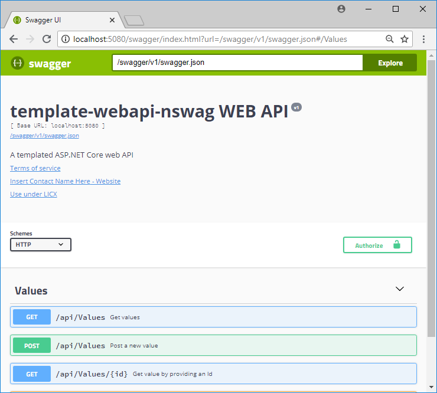
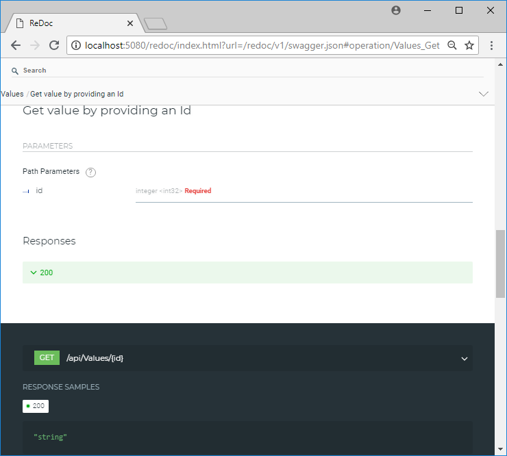

# OpenAPI Templates (Entity Framework)

ASP.NET Core Web API Template with Swagger and Entity Framework toolchain

## Getting Started

These instructions will get you a copy of the project up and running on your local machine for development and testing purposes. See deployment for notes on how to deploy the project on a live system.

### Prerequisites

* .NET core https://github.com/dotnet/core/releases
* nuget command line tools available at https://www.nuget.org/downloads

## Install template
```
nuget pack Wigo4It.WebApiNSwagEfTemplate.CSharp.nuspec
dotnet new -i Wigo4It.WebApiNSwagEfTemplate.CSharp.1.0.0.nupkg
```
The template **W4WebAPiNSwagEf** should now appear in the .NET core template list

| Templates |  Short Name | Language |Tags|
|:---|:---|:---|:---|
|Console Application|console|[C#], F#, VB|Common/Console| 
Class library| classlib| [C#], F#, VB |Common/Library|
|.......|....... |....... |...... |
|**WIGO4IT NSwag EF OpenAPI**| **W4WebApiNSwag**|**[C#]**| **WebAPI/OpenAPI/Swagger/Entity Framework**
ASP . NET Core with Angular|angular|[C#]|Web/MVC/SPA|
|.......|....... |....... |...... |

You can also run the build-template.bat file from the command line.

## Uninstall template
```
dotnet new -u Wigo4It.WebApiNSwagEfTemplate.CSharp
```

## Using the template

Create a folder that reflects the name of your api i.e. MyApi (and your namespace).
From within the folder execute the following command:

```
dotnet new W4WebApiNSwagEf
```

MyApi.csproj should now have been created, and the namespace should also reflect MyAPI in the source code files.

### Building Docker Images

The docker compose yaml will automatically reflect your namespaces/projectname.

```
docker-compose up --build -d
```

The API should now be reachable from:

* [SWAGGER](http://localhost:5080/swagger) - Swagger API documentation page
* [REDOC](http://localhost:5080/redoc) - Redoc API documentation page




## Built With

* [VSCODE](https://code.visualstudio.com/) - The IDE used
* [DOCKER](https://www.docker.com/) - Build, Ship, and Run Any App, Anywhere

## Contributing

Pull requests are accepted

## Authors

* **Sjef van Leeuwen** - *Initial work* - [github](https://github.com/sjefvanleeuwen)

## License

This project is licensed under the GPL-V3 License - see the [LICENSE.md](LICENSE.md) file for details
