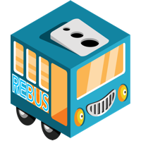
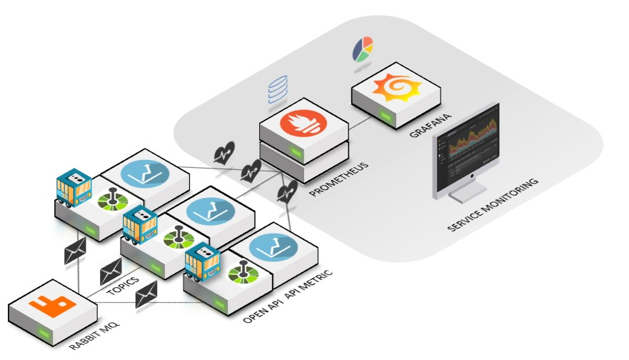

# OpenAPI Templates (Entity Framework with Rebus)

ASP.NET Core Web API Template with Swagger, ODATA and Entity Framework toolchain.  
Rebus is included as a lean service bus.

<!--  -->


## Overview



## Getting Started

These instructions will get you a copy of the project up and running on your local machine for development and testing purposes. See deployment for notes on how to deploy the project on a live system.


### Prerequisites

* .NET core https://github.com/dotnet/core/releases
* nuget command line tools available at https://www.nuget.org/downloads

## Install template
```
nuget pack WebApiNSwagEfRebusTemplate.nuspec
dotnet new -i WebApiNSwagEfRebusTemplate.1.0.0.nupkg
```
The template **W4WebAPiNSwagEfRebus** should now appear in the .NET core template list

| Templates |  Short Name | Language |Tags|
|:---|:---|:---|:---|
|Console Application|console|[C#], F#, VB|Common/Console| 
Class library| classlib| [C#], F#, VB |Common/Library|
|.......|....... |....... |...... |
|**NSwag EF with Rebus OpenAPI**| **W4WebApiNSwagEfRebus**|**[C#]**| **WebAPI/OpenAPI/Swagger/EF/Rebus**
ASP . NET Core with Angular|angular|[C#]|Web/MVC/SPA|
|.......|....... |....... |...... |

You can also run the build-template.bat file from the command line.

## Uninstall template
```
dotnet new -u WebApiNSwagEfRebusTemplate
```

## Using the template

Create a folder that reflects the name of your api i.e. my-api (and your namespace).
From within the folder execute the following command:

```
dotnet new W4WebApiNSwagEfRebus
```

may-api.csproj should now have been created, and the namespace should also reflect my-api in the source code files.

### Building Docker Images

#### For Testing

The application comes with a docker compose for RabbitMQ using AMQP for pub/sub.

In the ./test folder you will have the yaml file.

```
docker-compose up -d
```

You can access the RabbitMQ management console from http://localhost:15672    
User: quest  
Password: guest  

AMQP is available from amqp://localhost:5672  and is used in the UnitTests

## Built With

* [VSCODE](https://code.visualstudio.com/) - The IDE used
* [DOCKER](https://www.docker.com/) - Build, Ship, and Run Any App, Anywhere

## Contributing

Pull requests are accepted

## Authors

* **Sjef van Leeuwen** - *Initial work* - [github](https://github.com/sjefvanleeuwen)

## License

This project is licensed under the GPL-V3 License - see the [LICENSE](LICENSE) file for details
